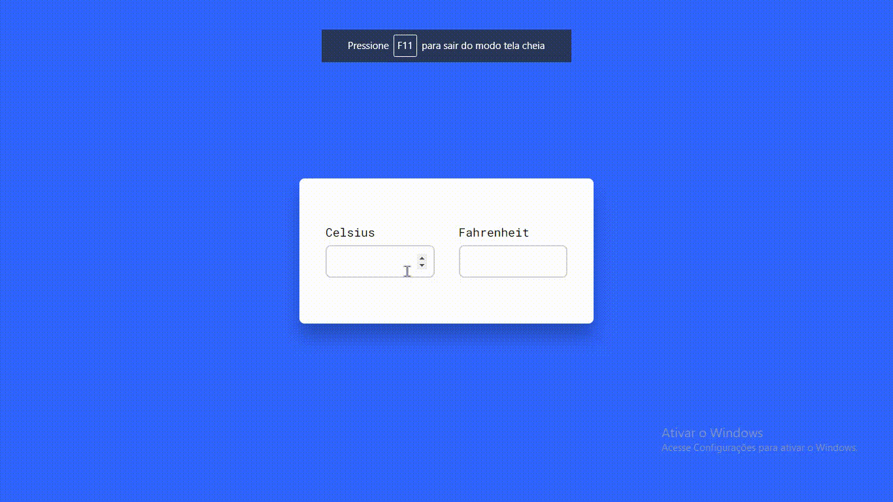

# Conversor de temperatura [Temperature Converter ]

  Conversor de temperatura feito por mim, para melhorar as minhas habilidades ᕙ(`▿´)ᕗ 
  
  [ Temperature converter made by me to improve my skills  ]

<!-- 
¯\_(ツ)_/¯ ¯\_(ツ)_/¯ ¯\_(ツ)_/¯
 -->

<!-- 
 (*￣▽￣)ノ”(^∇^*)  
 -->

### Linguagens usadas [ Languages used ]

           HTML5 <!--❤️--> ✔

      CSS3 <!--💙--> ✔

JavaScript <!--💛--> ✔

  

                                           
                                                      
                                                      
                                                      
